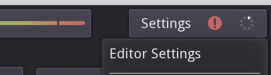
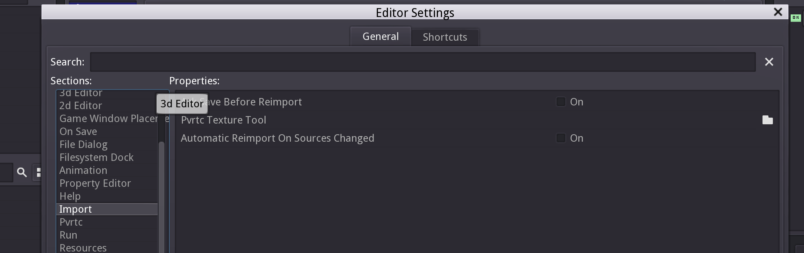
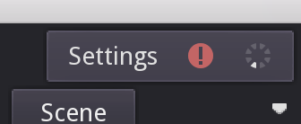
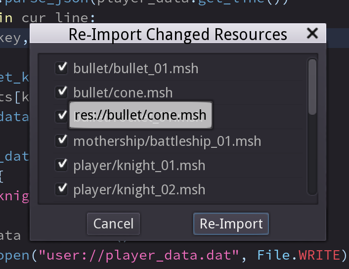

v2.1 기준으로 obj파일에서 mesh를 가져올 때 msh파일에 집어넣는 obj파일 경로에대한 해쉬값(확실치않음)이 Windows와 Mac에서 다르게 계산된다  
이 때문에 Automatic Re-import를 켜두면 작업하는 머신에 따라 프로젝트를 열거나 씬이 갱신될 때 msh파일이 계속 바뀐것으로 나오는 불편함이 있다  
더군다나 이 re-import시에 mesh안에 surface관련 설정들이 날아가버리는 경우가 있어서 특정 케이스에서는 아예 버그도 발생한다  
따라서 꺼두는게 속편함

disable auto re-import step
============

then how to re-import
============
우상단 settings 옆 아이콘이 초록색일때는 re import 할 리소스가 없다는 뜻  
만약 아이콘이 빨간색에 가운데 느낌표가 있을 경우 클릭하면 re import 할 리소스를 정할 수 있다  
  
